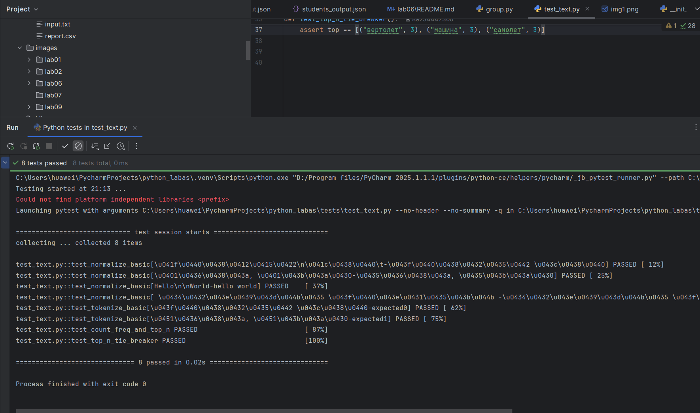
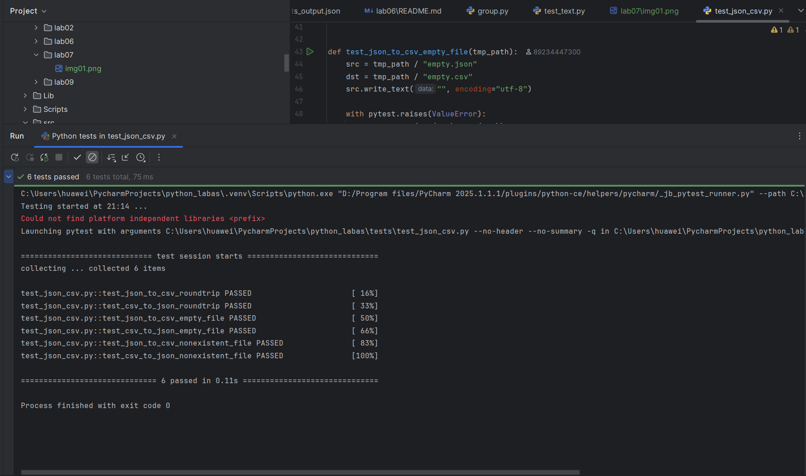

## Лаба 7

#### test_text.py

``` python
import pytest
from src.lib.text import normalize, tokenize, count_freq, top_n

@pytest.mark.parametrize(
    "source, expected",
    [
        ("ПриВЕТ\nМир\t", "привет мир"),
        ("Ёжик, Ёлка", "ежик, елка"),
        ("Hello\n\nWorld", "hello world"),
        (" двойные пробелы ", "двойные пробелы"),
    ],
)
def test_normalize_basic(source, expected):
    assert normalize(source) == expected

@pytest.mark.parametrize(
    "source, expected",
    [
        ("привет мир", ["привет", "мир"]),
        ("ёжик, ёлка", ["ёжик", "ёлка"]),
    ],
)
def test_tokenize_basic(source, expected):
    assert tokenize(source) == expected

def test_count_freq_and_top_n():
    tokens = ["самолет", "машина", "самолет", "машина", "машина"]
    freq = count_freq(tokens)
    top = top_n(freq, 2)

    assert top == [("машина", 3), ("самолет", 2)]

def test_top_n_tie_breaker():
    freq = {"самолет": 3, "машина": 3, "вертолет": 3}
    top = top_n(freq, 3)

    assert top == [("вертолет", 3), ("машина", 3), ("самолет", 3)]
``` 



#### test_json_csv.py

``` python
import pytest
import json
import csv
from pathlib import Path
from src.lab05.json_csv import json_to_csv, csv_to_json


def test_json_to_csv_roundtrip(tmp_path):
    src = tmp_path / "test.json"
    dst = tmp_path / "test.csv"
    data = [
        {"name": "Alice", "age": 22},
        {"name": "Bob", "age": 25},
    ]
    src.write_text(json.dumps(data), encoding="utf-8")
    json_to_csv(str(src), str(dst))

    with dst.open(encoding="utf-8") as f:
        rows = list(csv.DictReader(f))

    assert len(rows) == 2
    assert {"name", "age"} <= set(rows[0].keys())


def test_csv_to_json_roundtrip(tmp_path):
    src = tmp_path / "test.csv"
    dst = tmp_path / "test.json"

    with src.open('w', encoding="utf-8", newline='') as f:
        writer = csv.DictWriter(f, fieldnames=["name", "age"])
        writer.writeheader()
        writer.writerow({"name": "Mayk", "age": "27"})
        writer.writerow({"name": "Kira", "age": "25"})

    csv_to_json(str(src), str(dst))

    with dst.open(encoding="utf-8") as f:
        data = json.load(f)

    assert len(data) == 2


def test_json_to_csv_empty_file(tmp_path):
    src = tmp_path / "empty.json"
    dst = tmp_path / "empty.csv"
    src.write_text("", encoding="utf-8")

    with pytest.raises(ValueError):
        json_to_csv(str(src), str(dst))


def test_csv_to_json_empty_file(tmp_path):
    src = tmp_path / "empty.csv"
    dst = tmp_path / "empty.json"
    src.write_text("", encoding="utf-8")

    with pytest.raises(ValueError):
        csv_to_json(str(src), str(dst))


def test_json_to_csv_nonexistent_file():
    with pytest.raises(ValueError):
        json_to_csv("nonexistent.json", "output.csv")


def test_csv_to_json_nonexistent_file():
    with pytest.raises(ValueError):
        csv_to_json("nonexistent.csv", "output.json")
```


