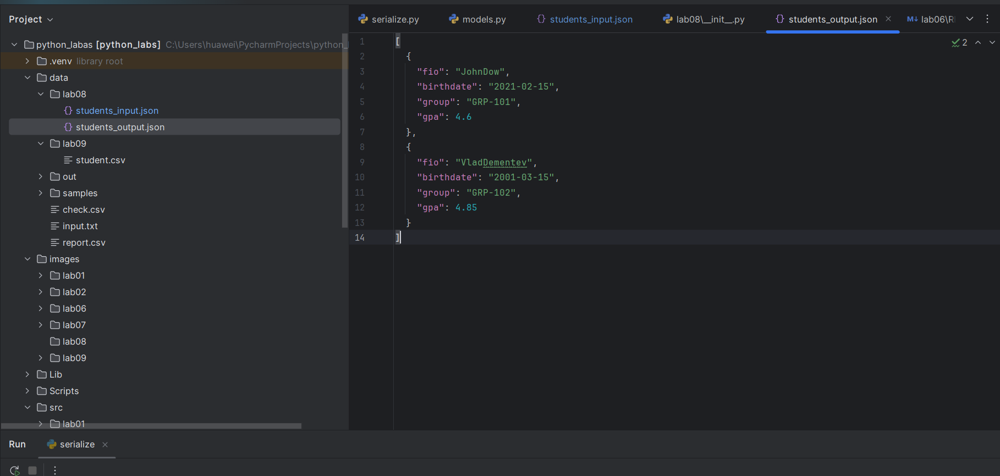
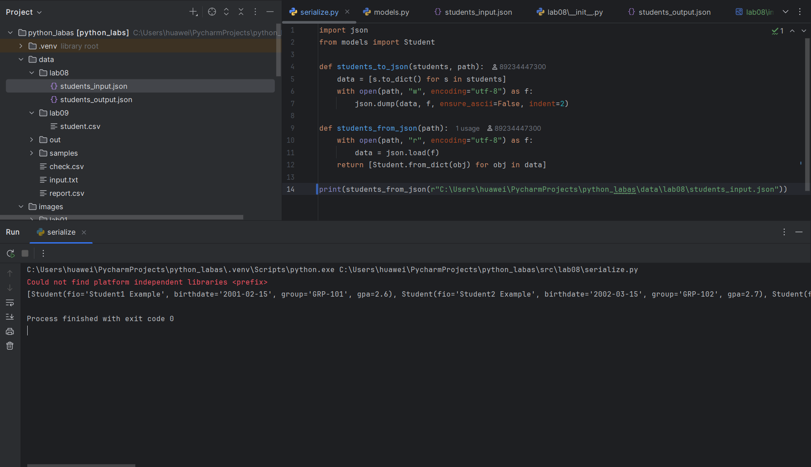

## Лаба 8

#### models.py
``` python
# imports
from dataclasses import dataclass
from datetime import datetime, date

@dataclass #декоратор (упрощает инициализацию класса, автоматически создает функции __init__ и __repr__ )
class Student:
    fio: str
    birthdate: str
    group: str
    gpa: float

    def __post_init__(self):
        if isinstance(self.gpa, str) or self.gpa < 0 or self.gpa > 5:
            raise ValueError('Invalid GPA-score')
        try:
            self._date_of_birth_ = datetime.strptime(self.birthdate, "%Y-%m-%d")
        except ValueError:
            raise ValueError("Invalid birthdate")

    def age(self) -> any:
        return date.today().year - self._date_of_birth_.year

    def to_dict(self) -> dict:
        return {
            "fio": self.fio,
            "birthdate": self.birthdate,
            "group": self.group,
            "gpa": self.gpa
        }

    @classmethod
    def from_dict(cls, d: dict):
        return Student(d["fio"], d["birthdate"], d["group"], d["gpa"])

    def __str__(self):
        return f'Obj Student. fio: {self.fio}, birthdate: {self.birthdate}, group: {self.group}, gpa: {self.gpa}'
``` 

#### serialize.py
``` python
import json
from models import Student

def students_to_json(students, path):
    data = [s.to_dict() for s in students]
    with open(path, "w", encoding="utf-8") as f:
        json.dump(data, f, ensure_ascii=False, indent=2)

def students_from_json(path):
    with open(path, "r", encoding="utf-8") as f:
        data = json.load(f)
    return [Student.from_dict(obj) for obj in data]

print(students_to_json([Student(fio='JohnDow', birthdate='2021-02-15', group='GRP-101', gpa=4.6), Student(fio='VladDementev', birthdate='2001-03-15', group='GRP-102', gpa=4.85)], r'C:\Users\huawei\PycharmProjects\python_labas\data\lab08\students_input.json'))
``` 



