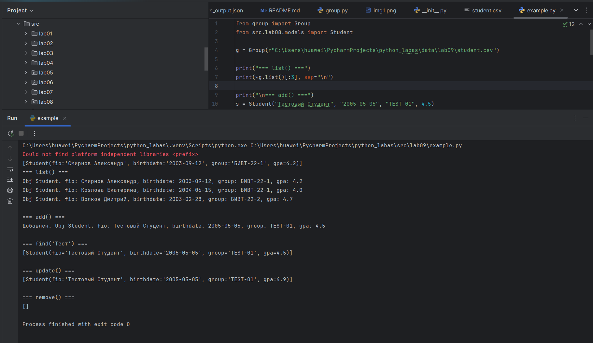

## Лаба 9


#### group example



#### group.py
``` python
import csv
from pathlib import Path
from typing import List
from src.lab08.models import Student


class Group:
    def __init__(self, storage_path: str):
        self.path = Path(storage_path)
        if not self.path.exists():
            self.path.write_text("", encoding="utf-8")

    def __read_all(self) -> List[dict]:
        with self.path.open('r', encoding='utf-8') as f:
            reader = csv.DictReader(f)
            return [row for row in reader]

    def list(self) -> List[Student]:
        rows = self.__read_all()
        return [Student(r["fio"], r["birthdate"], r["group"], float(r["gpa"])) for r in rows]

    def add(self, student: Student):
        rows = self.__read_all()
        rows.append({
            "fio": student.fio,
            "birthdate": student.birthdate,
            "group": student.group,
            "gpa": str(student.gpa)
        })
        with self.path.open('w', newline='', encoding='utf-8') as f:
            writer = csv.DictWriter(f, fieldnames=["fio", "birthdate", "group", "gpa"])
            writer.writeheader()
            writer.writerows(rows)

    def find(self, substr: str) -> List[Student]:
        rows = self.__read_all()
        found = [r for r in rows if substr in r["fio"]]
        return [Student(r["fio"], r["birthdate"], r["group"], float(r["gpa"])) for r in found]

    def remove(self, fio: str):
        rows = self.__read_all()
        for i, r in enumerate(rows):
            if r["fio"] == fio:
                rows.pop(i)
                break
        with self.path.open('w', newline='', encoding='utf-8') as f:
            writer = csv.DictWriter(f, fieldnames=["fio", "birthdate", "group", "gpa"])
            writer.writeheader()
            writer.writerows(rows)

    def update(self, fio: str, **fields):
        rows = self.__read_all()
        for r in rows:
            if r["fio"] == fio:
                for key, value in fields.items():
                    if key in ["fio", "birthdate", "group", "gpa"]:
                        r[key] = str(value)
                break
        with self.path.open('w', newline='', encoding='utf-8') as f:
            writer = csv.DictWriter(f, fieldnames=["fio", "birthdate", "group", "gpa"])
            writer.writeheader()
            writer.writerows(rows)
```

#### student.csv

``` 
fio,birthdate,group,gpa
Смирнов Александр,2003-09-12,БИВТ-22-1,4.2
Козлова Екатерина,2004-06-15,БИВТ-22-1,4.0
Волков Дмитрий,2003-02-28,БИВТ-22-2,4.7
Лебедева София,2004-08-22,БИВТ-22-2,3.8
Соловьёв Михаил,2003-11-05,БИВТ-22-3,4.9
Павлова Виктория,2002-12-18,БИВТ-22-3,3.5
Медведев Артём,2003-04-07,БИВТ-23-1,4.1
Антонова Алина,2004-01-30,БИВТ-23-1,4.6
Тихонов Владислав,2003-07-14,БИВТ-23-2,3.9
Филиппова Ксения,2004-10-08,БИВТ-23-2,4.3
Никитин Илья,2003-03-25,БИВТ-23-3,4.8
Макарова Юлия,2002-05-19,БИВТ-23-3,3.2
Захаров Кирилл,2003-08-11,БИВТ-24-1,4.4
Семёнова Дарья,2004-02-14,БИВТ-24-1,4.7
Борисов Максим,2003-12-03,БИВТ-24-2,3.7
Ковалёва Анастасия,2004-09-27,БИВТ-24-2,4.5
Герасимов Евгений,2003-06-09,БИВТ-24-3,4.0
Орлова Полина,2004-04-16,БИВТ-24-3,4.9
Давыдов Константин,2003-01-22,БИВТ-25-1,3.6
Жукова Елизавета,2004-07-04,БИВТ-25-1,4.2
```