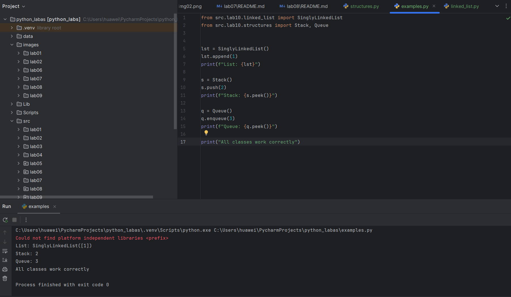

## Лаба 10

## Теоретическая часть

---

### Стек
Стек (англ. Stack) — это структура данных, работающая по принципу LIFO (Last In, First Out), где последний добавленный элемент извлекается первым.

#### Типичные операции:
- `push`: добавление элемента (O(1))
- `pop`: удаление верхнего элемента (O(1))
- `peek`: просмотр верхнего элемента без удаления (O(1))

### Очередь
Очередь (англ. Queue) — это структура данных, работающая по принципу FIFO (First In, First Out), где первый добавленный элемент извлекается первым.

Типичные операции:
- `enqueue`: добавление элемента в конец очереди (O(1))
- `dequeue`: удаление первого элемента (O(1))
- `peek`: просмотр первого элемента без удаления (O(1))

### Связный список
Связный список (англ. Linked List) — это структура данных, состоящая из узлов, где каждый узел содержит данные и ссылку на следующий узел.

Типичные операции:
- `append`: добавление элемента в конец списка (O(n))
- `prepend`: добавление элемента в начало списка (O(1))
- `insert`: вставка элемента по индексу (O(n))
- `remove_at`: удаление элемента по индексу (O(n))

## Реализованные классы

### Класс Stack

``` python
stack = Stack()
stack.push(1)
stack.push(2)
print(stack.pop())  # 2
print(stack.peek())  # 1
```

### Класс Queue
``` python
queue = Queue()
queue.enqueue("A")
queue.enqueue("B")
print(queue.dequeue())  # "A"
print(queue.peek())  # "B"
```

### Класс SinglyLinkedList
``` python
ll = SinglyLinkedList()
ll.append(10)
ll.prepend(5)
ll.insert(1, 7)
print(ll.plotter())  # [5] -> [7] -> [10] -> None
ll.remove_at(1)
print(ll.plotter())  # [5] -> [10] -> None
```

### Выводы по Бенчмаркам
- Стек и очередь имеют одинаковую сложность операций (O(1)) благодаря использованию списков и deque.
- Связный список медленнее для операций вставки и удаления в середине или конце (O(n)), так как требуется проход по элементам.
- Для задач, где важна скорость доступа к началу или концу, стек и очередь предпочтительнее.
- Связный список полезен, если требуется частое добавление/удаление элементов в произвольных местах.

#### example



#### structures

``` python
from collections import deque


class Stack:
    def __init__(self):
        self._data = []

    def push(self, item):
        self._data.append(item)

    def pop(self):
        if self.is_empty():
            raise IndexError("pop from empty stack")
        return self._data.pop()

    def peek(self):
        if self.is_empty():
            return None
        return self._data[-1]

    def is_empty(self) -> bool:
        return len(self._data) == 0


class Queue:
    def __init__(self):
        self._data = deque()

    def enqueue(self, item):
        self._data.append(item)

    def dequeue(self):
        if self.is_empty():
            raise IndexError("dequeue from empty queue")
        return self._data.popleft()

    def peek(self):
        if not self._data:
            return None
        return self._data[0]

    def is_empty(self) -> bool:
        return not self._data
```

#### linked_list

``` python
class Node:
    def __init__(self, value, next=None):
        self.value = value
        self.next = next


class SinglyLinkedList:
    def __init__(self):
        self.head = None
        self._size = 0
        self.tail = None

    def append(self, value):
        new_node = Node(value)

        if self.head is None:
            self.head = new_node
            self.tail = new_node
        else:
            self.tail.next = new_node
            self.tail = new_node

        self._size += 1

    def prepend(self, value):
        new_node = Node(value, next=self.head)
        self.head = new_node

        if self.tail is None:
            self.tail = new_node

        self._size += 1

    def insert(self, idx, value):
        if idx < 0 or idx > self._size:
            raise IndexError(f"Index {idx} out of range [0, {self._size}]")

        if idx == 0:
            self.prepend(value)
        elif idx == self._size:
            self.append(value)
        else:
            current = self.head
            for _ in range(idx - 1):
                current = current.next

            new_node = Node(value, next=current.next)
            current.next = new_node
            self._size += 1

    def remove(self, value):
        if self.head is None:
            return

        if self.head.value == value:
            self.head = self.head.next
            self._size -= 1
            if self.head is None:
                self.tail = None
            return

        current = self.head
        while current.next is not None:
            if current.next.value == value:
                current.next = current.next.next
                self._size -= 1
                if current.next is None:
                    self.tail = current
                return
            current = current.next

    def remove_at(self, idx):
        if idx < 0 or idx >= self._size:
            raise IndexError(f"Index {idx} out of range [0, {self._size})")

        if idx == 0:
            self.head = self.head.next
            if self.head is None:
                self.tail = None
        else:
            current = self.head
            for _ in range(idx - 1):
                current = current.next

            current.next = current.next.next
            if current.next is None:
                self.tail = current

        self._size -= 1

    def __iter__(self):
        current = self.head
        while current is not None:
            yield current.value
            current = current.next

    def __len__(self):
        return self._size

    def __repr__(self):
        values = list(self)
        return f"SinglyLinkedList({values})"
```
